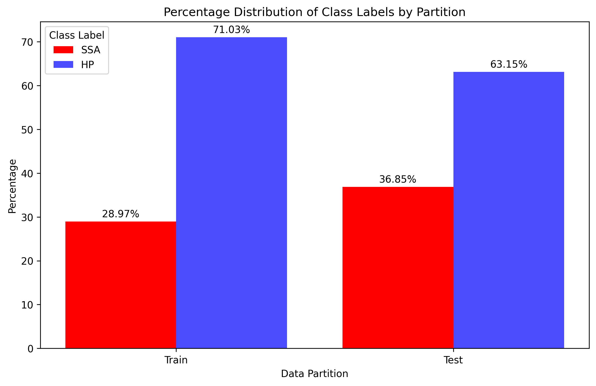
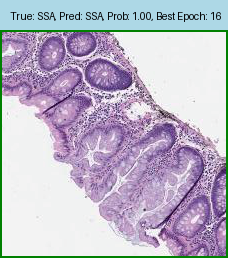
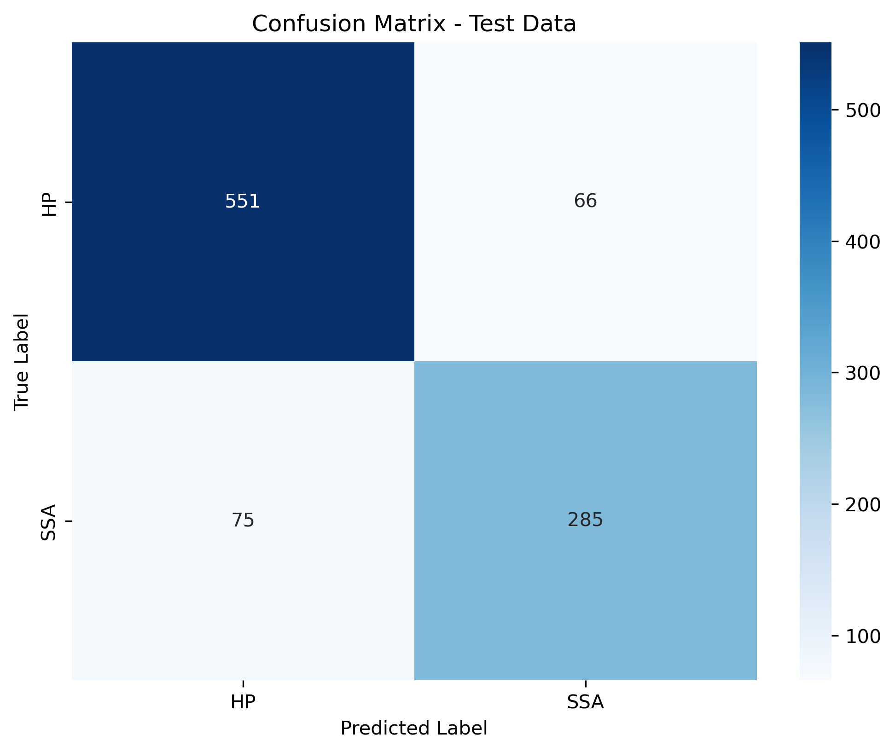
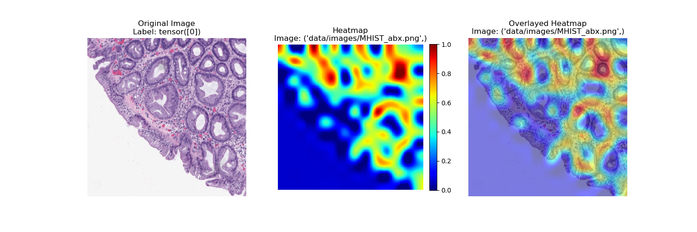

# MHIST Classification Project

This repository contains the code and configurations for training classification models on the MHIST dataset. The models include ResNet variants and Vision Transformers (ViT).

## --- Install Conda Virtual Environment ---
Install the Conda virtual environment using the given .yml file as shown below: \
conda env create -f pytorch-env-mhist.yml

## --- Download the MHIST data and save the images ---
After downloading the data, save all the images inside the 'data/images' folder.


## --- MHIST Data Distribution Visualization ---

Please run the code `python data_dist_visual.py` or run the following Jupyter Notebook files:  
- **`data_dist_plt_bar_visual.ipynb`**: For displaying the data distribution using `plt.bar` (from `matplotlib`)  
- **`data_dist_sns_visual.ipynb`**: For displaying the data distribution using `sns` (`seaborn`)
  
The distribution plots will be saved in the `dataset_plots` folder. Class imbalance in the dataset is as follows:
<div align="center">
  
</div>


## --- MHIST Classification Using ResNet Model ---

Before running the training code, please refer to the `config.yaml` file inside the `configs` directory to adjust the hyperparameters.

To run different ResNet variants, such as ResNet18 or ResNet34, change the `architecture` parameter to `"resnet18"` or `"resnet34"` (Options: `resnet18`, `resnet34`, `vit`, etc.). You can also choose whether to use a pretrained model or fine-tune the model with a specified number of layers.

For example, to use ResNet18 or ResNet34 with a pretrained model and fine-tune one layer, set the following in your `config.yaml`:

```yaml
architecture: "resnet18"  # or "resnet34"
pretrained: True
fine_tune_layers: 1
```

## --- MHIST Classification Using ViT Model ---

Similarly, before running the training code for the ViT model, refer to the `config.yaml` file inside the `configs` directory to adjust the hyperparameters. To run different ViT variants, such as variant: "base"  # Options: 'base', 'large', 'huge','custom-vit', change the `architecture` parameter to `"vit"` and then the variant parameter to your desired variant. (variants: 'base', 'large', 'huge','custom-vit', etc.). You can also choose whether to use a pretrained model or fine-tune the model with a specified number of layers. For example, to use ViT with a pretrained model and fine-tune one layer, set the following in your `config.yaml`:

```yaml
architecture: "vit"
variant: 'base'  # or 'large', 'huge','custom-vit'
pretrained: True
fine_tune_layers: 1
```
### Running the Training

To train the ViT model, use the following command:

```bash
python main.py
```

### Resuming Training

To resume training from a previous checkpoint, set resume: True in the config.yaml file:

```bash
resume: True
```
Some examples from the trained model's validation results after training have been saved in the `eval_results` folder. \
Trained models, along with their learning curves, as well as the last and best checkpoints, will be saved in the `trained_models` folder.


### Running the Testing

To evaluate the performance of the trained model on the test dataset, use the following command:

```bash
python test.py
```
Some examples from the trained model's test results have been saved in the `test_eval` folder. Test Result from ResNet18 Model:
<div align="center">
  
</div>

With confusion metrics:
<div align="center">
  
</div>

### Trained Model Comparison on the Test Set

| Model           | Pre-trained | Trainable Layers | Trainable Parameters | AUC   | Accuracy | Precision | Recall | F1-Score |
|-----------------|-------------|------------------|----------------------|-------|----------|-----------|--------|----------|
| ResNet-18 (M1)  | Yes         | 1                | 1026                 | 82.76 | 76.36    | 70.48     | 61.67  | 65.78    |
| ResNet-18 (M2)  | Yes         | 1                | 1026                 | 84.14 | 75.33    | 63.74     | 76.67  | 69.61    |
| ResNet-18 (M3)  | No          | All              | 11177538             | 86.94 | 79.22    | 70.39     | 75.28  | 72.75    |
| **ResNet-18 (M4)**  | **Yes**  | **5**            | **9575426**          | **91.49** | **85.57** | **81.2** | **79.17** | **80.17** |
| ResNet-18 (M5)  | Yes  | All           | 11177538          | 92.0 | 85.26 | 80.0 | 80.0 | 80.0 |
| ResNet-34 (M6)  | Yes         | 4                | 9442306              | 87.51 | 79.63    | 72.55     | 71.94  | 72.25    |
| ResNet-34 (M7)  | Yes         | 5                | 13115394             | 88.93 | 82.19    | 79.06     | 70.28  | 74.41    |
| ResNet-34 (M8)  | No         | All                | 21285698              | 83.9 | 76.46   | 73.38    | 56.67  | 63.95   |
| ResNet-34 (M9)  | Yes         | All                | 21285698              | 89.58 | 82.60   | 79.32    | 71.39  | 75.15    |
| ViT-Base (M10)   | Yes         | 2                | 7833602              | 82.54 | 74.31    | 62.76     | 74.44  | 68.11    |
| ViT-Base (M11)   | Yes         | 3                | 14921474             | 90.36	|81.78	|77.58	|71.11	|74.2|
| **ViT-Base (M12)**   | **Yes**         | **All**             |  **85800194** | **92.02** |  **85.47** | **78.39** | **83.61** | **80.91** |

**Model Descriptions:**

- **M1**: Base pre-trained ResNet-18 model, with only the last layer fine-tuned, without addressing data imbalance.
- **M2**: Pre-trained ResNet-18 model, with only the last layer fine-tuned, addressing data imbalance.
- **M3**: Non-pre-trained ResNet-18 model, with all layers trainable, addressing data imbalance.
- **M4 (Best Accuracy Model )**: Pre-trained ResNet-18 model, with the last 5 layers fine-tuned, addressing data imbalance.
- **M12 (Best AUC Model )**: Pre-trained ViT-Base model, with all layers fine-tuned, addressing data imbalance.
- **M5-M12*: Similar to M4, but with different architectures and varying numbers of trainable layers, all addressing data imbalance.\
  \
All models that address data imbalance utilize the same data augmentation and oversampling techniques.


### Running GradCam to Generate Heatmaps
To generate GradCam heatmaps, which visually explain the model's predictions by highlighting important regions in the input images, use the following command:

```bash
python test_gradcam.py
```
Some examples of the trained model's heatmap results have been saved in the `gradcam_images` folder.


`
